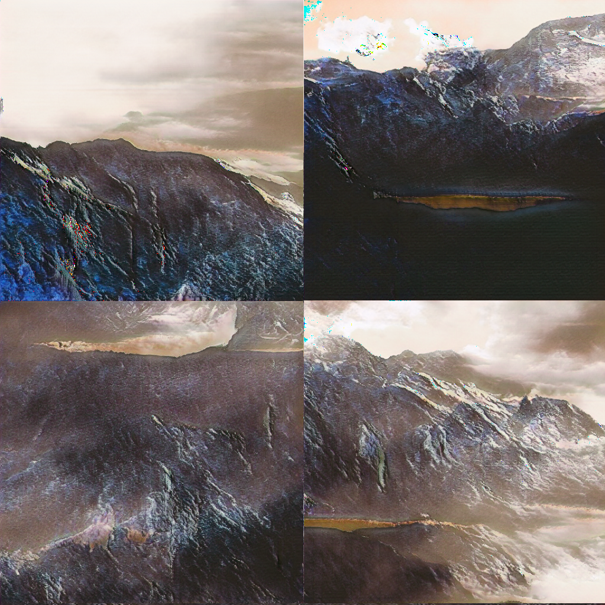

# Amazing Signts - Tensorflow 2.0 Implimentation of DCGAN

## Training

* first time

        python dcgan_fix_512_512.py --train --iteration 1000 --batch_size 8 --data_dir /path/to/your/images

* continue last training (Assuming alreay run 1000 iterations)

        python dcgan_fix_512_512.py --train --iteration 1000 --batch_size 8 --data_dir /path/to/your/images --restore_model --pre_low_step 1000

## Generate 8 Images

    python dcgan_fix_512_512.py --batch_size 8 --result_dir /path/to/your/results

## Results

around 8000 mountain images downloaded form Unsplash
https://drive.google.com/open?id=1256PUvIb3K1e8yx5HueTry7UedJUFgmK

## Demo Website
http://amazingsignts.ngrok.io

## Weights
https://drive.google.com/open?id=1DppoNi9fswsGfwOQbDiYiiKjr1DnuVAX

## Data
* around 8000 mountain images downloaded form Unsplash
* around 5000 building images downloaded form Unsplash
* around 4000 desert images downloaded form Unsplash
* around 3000 lake images downloaded form Unsplash
* around 1500 waterfall images downloaded form Unsplash
