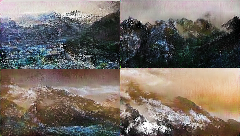
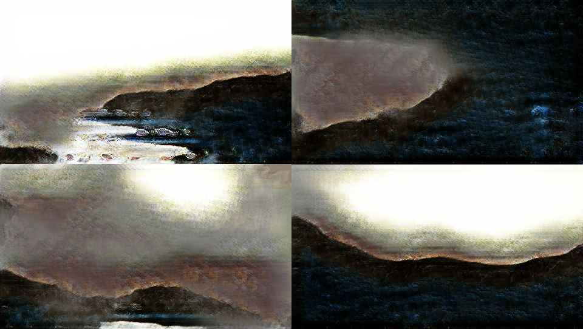

# StackGAN
Tensorflow-2.0 implementation of "[StackGAN: Text to Photo-realistic Image Synthesis with Stacked Generative Adversarial Networks](https://arxiv.org/abs/1612.03242)".

Based on ICCV 2017 paper, we try to use two stage to generate high resolution image from low resolution image without the condition of text. However, we face some problem that we can’t get better high resolution image by training stage II. Therefore, we still try to improve the model to get better results. 

## Usage

run `StackGAN.ipynb` and change the image path.

## Results

target size results

## Contributors
`StackGAN.ipynb` contributed by [Yuchi](https://github.com/yuchil)
